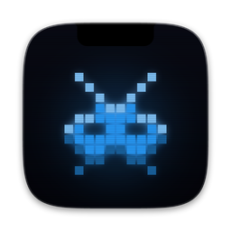
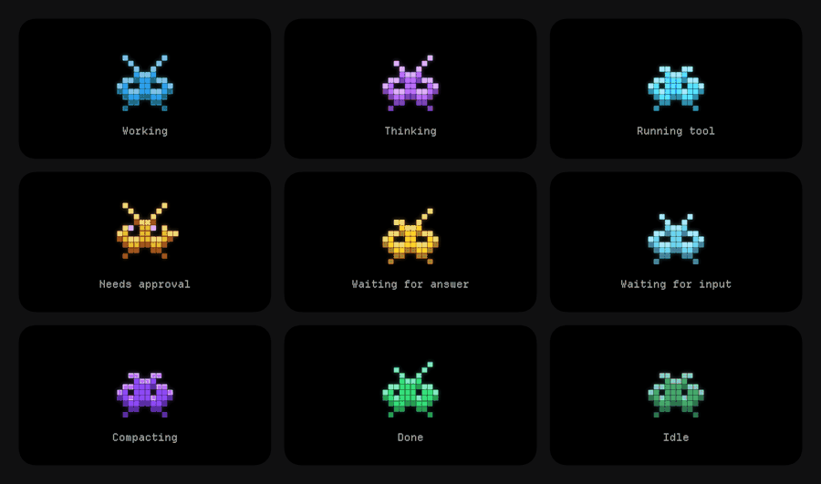
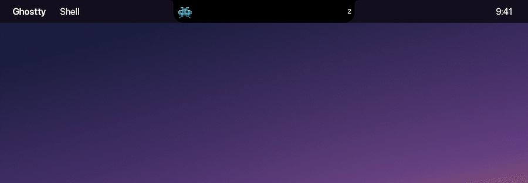
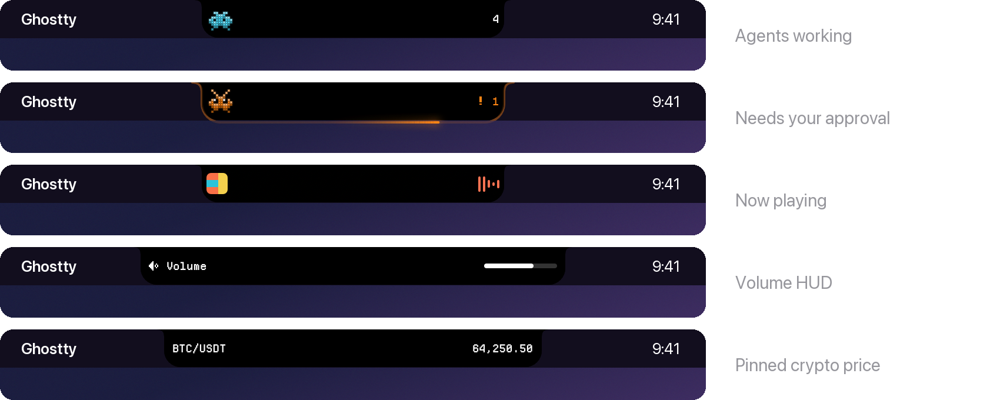
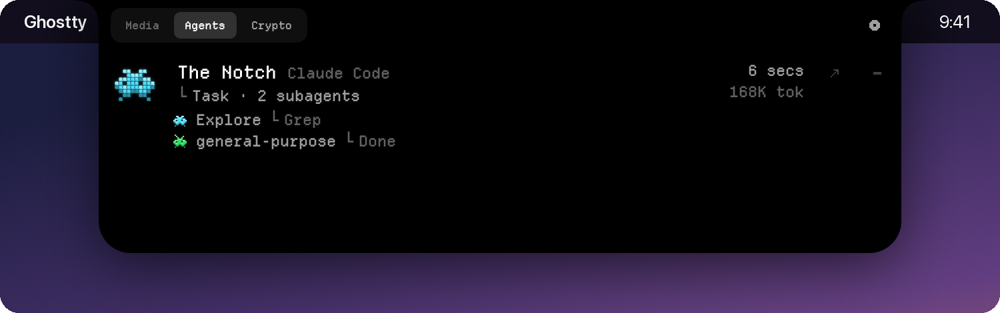
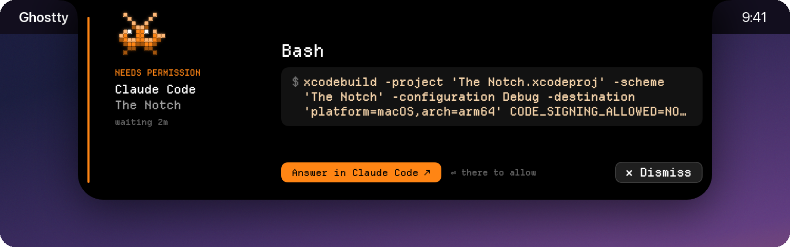
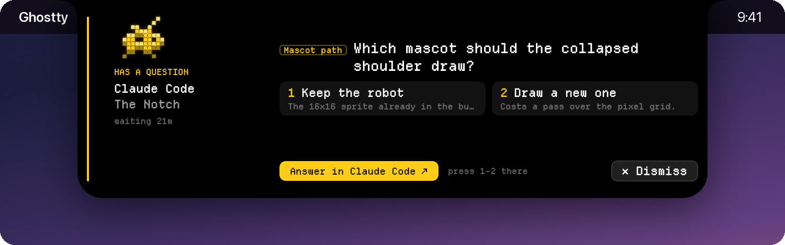
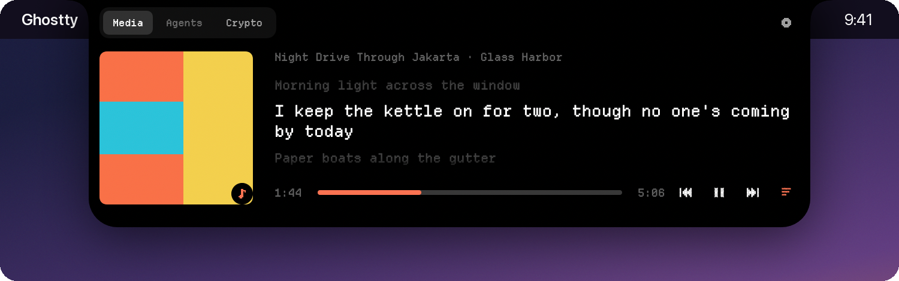
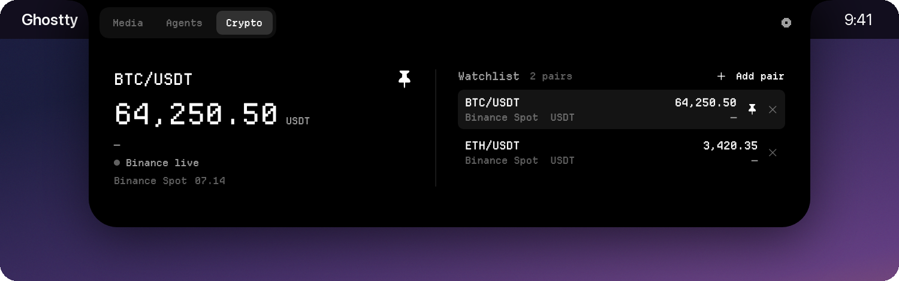
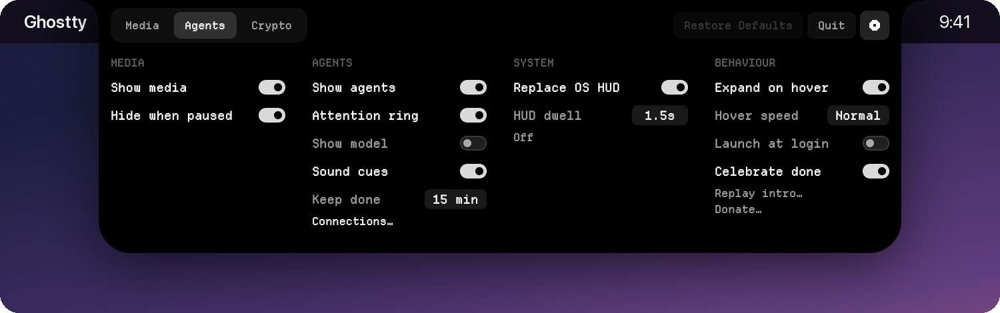

<p align="center">
  
</p>

<h1 align="center">The Notch</h1>

<p align="center">
  Your MacBook's notch, turned into a live control surface for AI coding agents,<br>
  media and system controls.
</p>

<p align="center">
  <a href="LICENSE"></a>
  <a href="https://github.com/sponsors/Vallykrie"></a>
</p>

<p align="center">
  
</p>

The Notch lives in the notch at the top of your screen. When a coding agent is working, a small
pixel mascot shows what it is doing. Hover over the notch to see every session, get a
heads-up the moment an agent needs your permission or asks a question, and keep an eye on your
music and crypto prices.

- **See every agent at a glance.** Claude Code, Codex, Gemini CLI, Cursor, OpenCode, Antigravity
  and Kiro sessions show up automatically, including subagents.
- **Know when an agent needs you.** A permission prompt makes the notch *pop* open with a shock
  ring; a question *drips* out of it. The card shows exactly what the agent wants, and one click
  takes you to the agent to answer. A finished run gets a burst of confetti.
- **A mascot that is alive.** Each state has its own motion and colour. It startles when it needs
  you, celebrates when it is done, and falls asleep when it has been idle for a while.
- **Media, HUD and crypto.** Now playing with controls and synced lyrics, a volume and
  brightness HUD that replaces the macOS one, and pinned Binance prices.
- **Asks before it touches anything.** On first launch the notch introduces itself and lists the
  agents it found; nothing is written to their config until you say yes.
- **Works on any Mac.** Macs without a notch get a drawn notch in the same place.

## What it looks like

**When an agent needs you**, the notch comes to you. A permission prompt pops it open, a
question drips out of it, and a finished run spills confetti:

<p align="center"></p>

**Closed**, the notch shows the most important thing right now:

<p align="center"></p>

**Open** (hover over the notch), it shows the full panel:

| Agents and subagents | A permission prompt |
| --- | --- |
|  |  |
| **A question, with its answers** | **Now playing, with synced lyrics** |
|  |  |
| **Crypto watchlist** | **Settings** |
|  |  |

## Install

You need macOS 14 or later. The app is universal, so it runs on Apple silicon and Intel Macs.

### With Homebrew (recommended)

```bash
brew install --cask vallykrie/tap/the-notch
```

### Or download the DMG

1. Download the latest `The-Notch-<version>.dmg` from
   [the releases page](https://github.com/Vallykrie/The-Notch/releases).
2. Open it and drag **The Notch** into **Applications**.

### First launch

Open **The Notch** from Applications. It has no Dock icon; it appears in the notch at the top of
your screen.

If macOS says it cannot verify the developer, **right-click the app → Open → Open**. You only need
to do this once. Beta builds are not notarised yet, and this step stops being needed once they
are.

## Tutorial

### 1. Open the panel

Move your pointer onto the notch and the panel opens. Move away and it closes. It has three tabs
at the top: **Media**, **Agents** and **Crypto**. The gear on the right opens **Settings**.

### 2. Connect your coding agents

The first time it runs, the notch introduces itself and asks before touching anything: it lists
the agents it found, and you can untick any of them. Once you say yes, The Notch looks for
installed agents every 30 seconds and adds its hook to each one you agreed to. If you said
"not now", nothing is written; **Settings → Replay intro…** asks again.

| Agent | Where the hook goes |
| --- | --- |
| Claude Code | `~/.claude/settings.json` |
| Codex | `~/.codex/hooks.json` (desktop and CLI activity are also read from local session files) |
| Gemini CLI | `~/.gemini/settings.json` |
| Cursor | `~/.cursor/hooks.json` |
| OpenCode | `~/.config/opencode/plugins/the-notch.js` |
| Antigravity | `~/.gemini/config/hooks.json` |
| Kiro | `~/.kiro/hooks/the-notch.json` |

Your existing hooks from other tools are kept. The Notch merges its entry in, never replaces the
file, and saves a backup next to it (`*.the-notch-backup.<date>`) before the first change.

**Start a new agent session** after installing, because agents only load hooks when a session
starts. To check the connection, go to **Settings → Connections…**. Each agent shows
*Receiving activity*, *Waiting for session*, *Not connected* or *Not detected*.

> **Codex:** to see Codex prompts in the notch, open `/hooks` in Codex and trust The Notch's
> hook. Codex asks again whenever a hook changes.

If the app is not running, agents behave exactly as before. The hook never blocks them.

### 3. Read the mascot

The closed notch shows the mascot for the agent you most recently gave work to, and how many
agents are running. The colour tells you the situation from across the room:

| Colour | Meaning |
| --- | --- |
| Blue / cyan | Working, running a tool, or waiting for your next prompt |
| Purple | Thinking or compacting its context |
| **Orange** | **Needs your approval.** The agent is stopped until you answer. |
| **Yellow** | **Asked you a question** |
| Green | Done |
| Dim green | Idle. It has been quiet for 5 minutes. |

When an agent is blocked on you, an orange ring also travels around the notch.

### 4. Permission prompts and questions

When an agent asks for permission, the notch pops open; when it asks a question, a drop forms
under the notch and the notch swallows it as it opens. The card shows who is asking and for how
long on the left, and on the right the command, or the question with its numbered answers. Press
**Answer in …** to jump to the agent, and answer there as usual. The card tells you which key to
press. It clears itself once the agent moves on, or press **✕ Dismiss**. If you leave a prompt
unanswered, the notch nudges you again every few seconds.

When a run finishes, the notch breathes out and drops a little confetti onto your desktop. Turn
that off with **Settings → Celebrate done**.

### 5. Keep the list tidy

Each row shows the project, what the agent is doing right now, elapsed time, tokens and cost.
Subagents appear indented under the session that started them.

- Hover over a row and click **–** to hide it. It comes back if that session does something new.
- **Clear Idle** removes every idle session at once.
- Sessions that go quiet become *Idle* after 5 minutes and leave the list after 15 minutes.

### 6. Media, volume and brightness

The **Media** tab shows what is playing from Spotify or Apple Music, with play/pause, skip and a
progress bar. While music plays, the closed notch shows the artwork and a live waveform. When
nothing is playing, the tab links straight to each installed player.

Press the lyrics button (the three lines in the controls) to follow the song's lyrics, synced to
playback. The controls move to a slim strip and the lyrics take the panel, and the closed notch
floats the line being sung in a small pill underneath it. Move your pointer near the pill and it
splashes out of the way, so you can click whatever it was covering. Lyrics come from [LRCLIB](https://lrclib.net),
a free lyrics database: the track's title and artist are sent there only while lyrics are on.
If the lookup fails, it retries on its own a couple of times; if lyrics still don't appear, press
**Try again**. Titles that players decorate (`- Remastered 2009`, `- From "…"`, `(feat. …)`) are
also searched without the extra part.

Turn on **Settings → Replace OS HUD** to see volume and brightness changes in the notch instead of
the macOS overlay. The app asks for the permission it needs to read the media keys.

### 7. Crypto

In the **Crypto** tab, use **Add pair** to search Binance Spot pairs (such as `BTC/USDT`) and
build a watchlist. Pin a pair to keep its live price in the closed notch. It uses Binance's
public feed, so there is no account or API key. See [Crypto feed details](docs/TRADING.md).

### 8. Settings

| Section | Options |
| --- | --- |
| Media | Show media, Hide when paused |
| Agents | Show agents, Attention ring, Sound cues, Keep done (how long finished sessions stay), Connections… |
| System | Replace OS HUD, HUD dwell (how long it stays on screen) |
| Behaviour | Expand on hover, Hover speed, Launch at login, Celebrate done, Replay intro…, Donate… |

**Quit** is in the top-right corner of Settings.

## Uninstall

```bash
brew uninstall --cask the-notch
```

Or quit the app and drag it from Applications to the Bin. The hooks it added to your agents are
harmless without the app: they fail open and let the agent carry on.

---

## For developers

### Build

Requires Xcode with the macOS 14 SDK. From the repository root, make a local unsigned Debug
build:

```bash
xcodebuild -project "The Notch.xcodeproj" \
  -scheme "The Notch" \
  -configuration Debug \
  -destination 'platform=macOS' \
  CODE_SIGNING_ALLOWED=NO \
  build
```

Releases are built by CI from `v*` tags; see [Releasing](docs/RELEASING.md).

### Tests and tools

| Command | What it checks |
| --- | --- |
| `bash tools/hook-harness/run-all.sh` | The hook bridge: happy path, allow, deny, timeout, concurrent sessions, malformed input. It never touches the real socket or agent config. Needs Go 1.22+. |
| `bash tools/session-tests/run.sh` | The session lifecycle (idle after 5 min, removed after 15 min, what is always kept) |
| `bash tools/trading-tests/run.sh` | The crypto store and watchlist migration |
| `NOTCH_FRAMES=<dir> "<app>/Contents/MacOS/The Notch"` | Renders every surface to PNGs. The screenshots above come from this. |
| `python3 scripts/render-app-icon.py` | Regenerates the app icon. See [App icon](docs/APP-ICON.md). |

### Documentation

- [Roadmap](docs/ROADMAP.md): phases and progress
- [Architecture](docs/ARCHITECTURE.md)
- [Hook protocol](tools/notch-hook/PROTOCOL.md)
- [Mascot design explorations](docs/design/): live HTML previews of the concepts behind the mascot

### Contributing

Issues and pull requests are welcome. See [CONTRIBUTING.md](CONTRIBUTING.md). To report a
security problem privately, see [SECURITY.md](SECURITY.md).

## Support The Notch

The Notch is free and open source, and it will stay that way. If it saves you time, you can help
fund its development:

- **[Sponsor on GitHub](https://github.com/sponsors/Vallykrie)**, monthly or one-time
- Or use **Settings → Donate…** inside the app

Starring the repo and telling a friend helps too.

## License

The Notch is released under the [MIT License](LICENSE). Copyright (c) 2026 Vallykrie. Bundled
third-party components and their notices are listed in
[THIRD_PARTY_LICENSES](THIRD_PARTY_LICENSES).

The Notch is an independent project and is not affiliated with or endorsed by any other notch
utility or AI agent vendor. Claude, Codex, Gemini and other product names are trademarks of
their respective owners.
